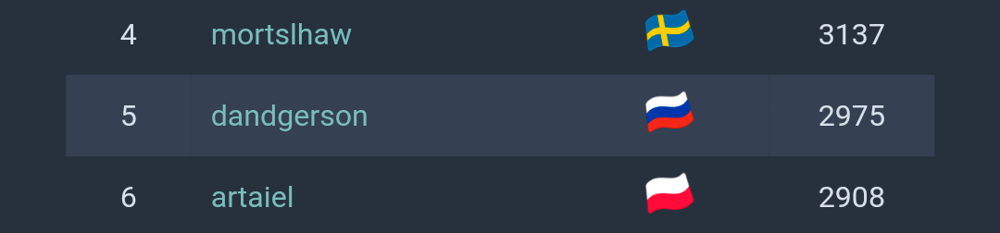

# 

**( russian | ukrainian )** (in progress)

## Dmitry G. Anderson

Hello, I'm Dmitry G. Anderson - Software Developer and JavaScript Enthusiast.
I'm in love with JavaScript programming language and building graphical web interfaces. Since November 2016 I dropped all of my others and began training my hard skills in Frontend Development and JavaScript like a weightlifter on steroids before starts.

I want growing up as much faster as its can and if you can load me cool js frontend stuff ***- I'm ready for job!***

If being more precisely, I ideally dream to building cool and complicated web apps, pumping up my brain with programming hard skills, learn more other cool hard frontend stuff, get awesome middle / senior mentor, and deep dive in cool project surrounded with my like-minded people.

*[**more about me**](./story.md)*

**one page PDF resume (en | rus | ukr)** (in progress)

*( if you thinking that you don't hire juniors, just [**read**](https://dev.to/isaacandsuch/if-you-dont-hire-juniors-you-dont-deserve-seniors-48kb?utm_source=Newsletter+Subscribers&utm_campaign=63b22361fd-EMAIL_CAMPAIGN_2018_09_24_18&utm_medium=email&utm_term=0_d8f11d5d1e-63b22361fd-154379453) )*

---

## Skills

| **Hard Skills** | *Soft Skills* | Other Skills |
| ----------- | ----------- | ------------ |
| **HTML and template engines** | *English language* | Blind 10-fingers fast typing |
| **CSS, basics of BEM, Sass(SCSS), Bootstrap** | *Psychology and pedagogy* | Repair of computer equipment, soldering and replacement of hardware electronic components |
| **JavaScript (ES2015+) / AJAX / OOP** | *Professional ethics and etiquette* | Decomposing tech tasks / Time management / Self organizing |
| **Basics of Nodejs & Express** | *Conflictology* | [workflowy](https://workflowy.com/invite/4eee4f34.emlx) / trello / kanban-like |
| **Basic concepts of functional programming** | *Public Relations* | Slack / Telegram / Skype |
| **Basics of TDD with unit tests using Mocha, Chai** | *Speech communication* | Google Docs |
| **Build systems Webpack, Gulp** | *Psychology of business communication* | |
| **Basics of PHP and MySQL** | | |
| **Basics of Wordpress** | | |
| **Git** | | |
| **CLI / Bash** | | |

## Experience

---

### December 2017 Project cooperation with internet marketing agency ["Зарядка"](https://zaradka.com)

* [more details about the project](./experience/svaer.md)
* [live project demo](http://svaer.zrdka.ru/)

**Short description:**
*Developing a corporate [website](http://svaer.zrdka.ru/) of the manufacturer in order to receive applications for the order of products.*

---

## Activity

### Education Projects

---

#### August 2018. REST API GUI Project

* [more details about the project](https://github.com/dandgerson/rest-api-gui)
* [live project demo](http://dandgerson.com/projects/rest-api-gui)

**Short description:**
*This app allows to interact with the REST API service using the simple graphical interface. It has the ability to perform basic requests to the server by interaction with graphical elements. The query result is dynamically displayed in the app output pane.*

---

#### November 2017 - July 2018. Long JavaScript programming learning session

* [more details about the project](https://github.com/dandgerson/learnJS)

**Short description:**
*My repo for studying JavaScript programming tasks and mini projects.*

---

#### October 2017. Gulp boilerplate template for frontend lite projects

* [more details about the project](https://github.com/dandgerson/template)

**Short description:**
*My custom gulp boilerplate for building lite projects.*

---

#### July 2017. Production one page portfolio website

* [more details about the project](https://github.com/dandgerson/bootstrapPortfolio)
* [live project demo](http://dandgerson.com/projects/bootstrapPortfolio)

**Short description:**
*Developing production portfolio website with HTML / Pug / CSS / Sass(SCSS), Bootsrap 4, and other third party libraries.*

---

#### May 2017. Production template for my own Wordpress portfolio theme

* [more details about the project](https://github.com/dandgerson/wordpressPortfolio)
* [live project demo](http://dandgerson.com/projects/wordpressPortfolio)

**Short description:**
*Developing template for Wordpress portfolio theme with HTML / CSS, Bootsrap 4 and other third party libraries.*

---

#### April 2017. Website stub

* [more details about the project](https://github.com/dandgerson/p2018)
* [live project demo](http://dandgerson.com/projects/p2018)

**Short description:**
*Developing website stub with HTML / CSS and Bootsrap 4.*

---

#### March 2017. Several small projects with Bootstrap 4

* Customize practice with The Bootstrap 4 basic Album template
  * [more details about the project](https://github.com/dandgerson/practice-with-customize-bootstrap4-template)
  * [live project demo](http://dandgerson.com/projects/codeBand/)
* Basic one page website with bootstrap 4
  * [more details about the project](https://github.com/dandgerson/basic-web-site-with-bootstrap4)
  * [live project demo](http://dandgerson.com/projects/silentWorld/)
* Landing page with bootstrap 4
  * [more details about the project](https://github.com/dandgerson/appLandingPage)
  * [live project demo](http://dandgerson.com/projects/appLandingPage/)

**Short description:**
*This is three small education projects with HTML / CSS and Bootsrap 4.*

---

#### March 2017. Social Page by Memory Konstantin Stupin

* [more details about the project](https://github.com/dandgerson/stupa)
* [live project demo](http://dandgerson.com/projects/stupa/)

**Short description:**
*This is Social Page by Memory Konstantin Stupin.*

---

#### February 2017. Sketch for Powerlifting Federation website

* [more details about the project](https://github.com/dandgerson/fpr76.ru)
* [live project demo](http://dandgerson.com/projects/fpr76.ru/)

**Short description:**
*This is semi-education social project aims to build a sketch for Powerlifting Federation website for future usage and gain expertize with web development technologies.*

---

#### December 2016. My first HTML / CSS and Bootstrap education project

* [more details about the project](https://github.com/dandgerson/anderson.su)
* [live project demo](http://dandgerson.com/projects/anderson.su/)

**Short description:**
*This is my first education project when I got acquainted with the technologies of web development.*

---

### Profiles

* [github.com](https://github.com/dandgerson)
  * > Main profile
* [codepen.io](https://codepen.io/dandgerson/)
  * > Have there a lot of code examples, solved problems, components, written during the my javascript study from begin to last time. There you can see how growed complexity of solved problems during the time
* [stackoverflow.com](https://stackoverflow.com/users/7360033/dmitry-g-anderson)
* [upwork.com](https://www.upwork.com/freelancers/~01d9b90c1ce0ba2e06)
* [codewars.com](https://www.codewars.com/users/dandgerson)
  * > Codewars is a community of developers, who are called Code Warriors (or just warriors), that train on improving their development skills. Think of it like a coding dojo - where developers train with each other and help each other get better through practice.
* [warriorjs.com](https://warriorjs.com/dandgerson)
  * > Are you in need for JavaScript developers? WarriorJS can help you find talent by looking at the players' problem-solving approach and directly reaching out to the best candidates.
  * 

## Education

### Academic Degree

Specialist degree in Sociology (five years of education) 2011: [part 1](./academic_degree/1.jpg), [part 2](./academic_degree/2.jpg), [part 3](./academic_degree/3.jpg), [part 4](./academic_degree/4.jpg)

### Qualification Certificates

* [CCA: Cambridge Certification Authority](https://www.the-cca.org) :
  * [HTML Level 1](./certificates_qualification/CCA-Certificate-HTML_Level_1.pdf)
  * [CSS Level 1](./certificates_qualification/CCA-Certificate-CSS_Level_1.pdf)
  * [JavaScript Level 1](./certificates_qualification/CCA-Certificate-Javascript_Level_1.pdf)
  * [jQuery Level 1](./certificates_qualification/CCA-Certificate-jQuery_Level_1.pdf)

### Courses

* Main Courses in progress
  * [OTUS. Разработчик JavaScript 2019](https://otus.ru/lessons/javascript/?int_source=courses_catalog&int_term=programming) (in progress)
  * [NodeJS - The Complete Guide (incl. MVC, REST APIs, GraphQL)](https://www.udemy.com/course/nodejs-the-complete-guide/) (in progress)
  * [React - The Complete Guide (incl Hooks, React Router, Redux)](https://www.udemy.com/react-the-complete-guide-incl-redux/) (in progress)
  * [MongoDB - The Complete Developer's Guide](https://www.udemy.com/mongodb-the-complete-developers-guide/) (in progress)

* HTML and CSS
  * [Udacity.com : Intro to HTML and CSS 2017](https://www.udacity.com/course/intro-to-html-and-css--ud001) : Free
  * [Udacity.com : Responsive Web Design Fundamentals 2017](https://www.udacity.com/course/responsive-web-design-fundamentals--ud893) : Free
  * [Udacity.com : Responsive Images 2017](https://www.udacity.com/course/responsive-images--ud882) : Free
  * [Udemy.com : The Complete Flexbox Tutorial: Learn CSS3 Flexbox in 2018](https://www.udemy.com/flexbox-tutorial/) : [certificate](./certificates_courses/complete_flexbox_tutorial.pdf)
  * [Udemy.com : Bootstrap 4 Quick Start: Code Modern Responsive Websites 2017](https://www.udemy.com/bootstrap-4/) : [certificate](./certificates_courses/bootstrap4_quick_start.pdf)
  * [Udemy.com : The Complete Web Developer Course 2.0 2018](https://www.udemy.com/the-complete-web-developer-course-2/) (in progress)
* JavaScript
  * [JAVASCRIPT.INFO : JavaScript/DOM/Interfaces 2018 (Iliya Kantor)](http://javascript.info/courses/js)
  * [khanacademy.org : Intro to JS: Drawing & Animation 2018](https://www.khanacademy.org/computing/computer-programming/programming) (in progress)
  * [Udemy.com : Build a Complete JQuery Plugin 2017](https://www.udemy.com/build-a-complete-jquery-plugin-image-pop-up-dialog/) : [certificate](./certificates_courses/build_jquery_plugin.pdf)
  * [Udemy.com : Learn jQuery 2017](https://www.udemy.com/draft/591586/) : [certificate](./certificates_courses/learn_jquery.pdf)
* Git
  * [Udacity.com : Version Control with Git 2017](https://www.udacity.com/course/version-control-with-git--ud123) : Free
  * [Udacity.com : How to Use Git and GitHub 2017](https://classroom.udacity.com/courses/ud775) : Free
  * [Udacity.com : GitHub & Collaboration 2017](https://classroom.udacity.com/courses/ud456) : Free
* CLI / Bash
  * [Udacity.com : Linux Command Line Basics 2017](https://www.udacity.com/course/linux-command-line-basics--ud595) : Free
* Others
  * [Coursera.com : Learning How to Learn 2018](https://www.coursera.org/learn/learning-how-to-learn/home/welcome) : Free (in progress)
  * [Udacity.com : Refresh Your Resume 2018](https://classroom.udacity.com/courses/ud243) : Free

### Read Books

* Main Books in progress
  * [JavaScript for impatient programmers (ES1–ES2019) by Dr. Axel Rauschmayer](http://exploringjs.com/impatient-js/index.html) in progress
  * [Speaking JavaScript: An In-Depth Guide for Programmers by Dr. Axel Rauschmayer](http://speakingjs.com/) in progress
  * [Mastering JavaScript Object-Oriented Programming by Andrea Chiarelli](https://www.oreilly.com/library/view/mastering-javascript-object-oriented/9781785889103/) (in progress)
  * [Learning JavaScript Design Patterns. By Addy Osmani](https://addyosmani.com/resources/essentialjsdesignpatterns/book/) (in progress)
  * [Head First Design Patterns. By Bert Bates, Kathy Sierra, Eric Freeman, Elisabeth Robson](http://shop.oreilly.com/product/9780596007126.do) (in progress)
  * [Design patterns : elements of reusable object-oriented software. By Erich Gamma, Richard Helm, Ralph Johnson, John Vlissides 1994](https://www.amazon.co.uk/Design-patterns-elements-reusable-object-oriented/dp/0201633612) (in progress)
  * [Real-World Algorithms A Beginner's Guide By Panos Louridas 2017](https://mitpress.mit.edu/books/real-world-algorithms) (in progress)

* HTML and CSS
  * [CSS Secrets: Better Solutions to Everyday Web Design Problems. By Lea Verou 2015](https://www.amazon.co.uk/CSS-Secrets-Solutions-Everyday-Problems/dp/1449372635)
* JavaScript
  * [The Modern JavaScript Tutorial. By Iliya Kantor 2018](http://javascript.info/)
  * [Современный учебник Javascript. By Iliya Kantor 2018](http://learn.javascript.ru/)
  * [Understanding ECMAScript 6. By Nicholas C. Zakas 2018](https://leanpub.com/understandinges6)
  * [Exploring ES6 by Dr. Axel Rauschmayer](http://exploringjs.com/es6.html)
  * [Eloquent JavaScript 3rd edition. By Marijn Haverbeke 2018](https://eloquentjavascript.net/) (in progress)
  * [JavaScript Fundamentals Handbook. By Flavio Copes 2018](https://flaviocopes.com/javascript/)
  * [JavaScript Pocket Reference, 3rd Edition. By David Flanagan 2012](http://shop.oreilly.com/product/0636920011460.do)
  * [JavaScript: The Definitive Guide, 6th Edition. By David Flanagan 2011](http://shop.oreilly.com/product/9780596101992.do)
  * [Head First JavaScript Programming. By Eric T. Freeman, Elisabeth Robson 2014](https://www.amazon.co.uk/Head-First-JavaScript-Programming-Freeman/dp/144934013X/ref=dp_ob_title_bk)
* JQuery
  * [JQuery in Action. By Bear Bibeault, Yehuda Katz, Aurelio De Rosa 2015](https://books.google.co.uk/books/about/JQuery_in_Action.html?id=vk91oAEACAAJ&source=kp_cover&redir_esc=y) (in progress)
* Node.js
  * [Node.js Handbook. By Flavio Copes 2018](https://flaviocopes.com/node-javascript-language/)
  * [Node.js in Action. Mike Cantelon, Marc Harter, T.J. Holowaychuk, and Nathan Rajlich Foreword by Isaac Z. Schlueter](https://www.manning.com/books/node-js-in-action) (in progress)
* PHP and MySQL
  * [Learning PHP, MySQL, JavaScript, CSS & HTML5: A Step-by-Step Guide to Creating Dynamic Websites. By Robin Nixon 2014](https://www.amazon.co.uk/Learning-MySQL-JavaScript-HTML5-Step/dp/1491949465)
  * [PHP: The "Right" Way. By Phil Sturgeon and Josh Lockhart 2016](https://leanpub.com/phptherightway) (in progress)
* About programming in general
  * [Code Complete: A Practical Handbook of Software Construction. By Steve McConnell 2004](https://www.amazon.co.uk/Code-Complete-Practical-Handbook-Construction/dp/0735619670/ref=asap_bc?ie=UTF8) (in progress)
  * [Clean Code: A Handbook of Agile Software Craftsmanship (Robert C. Martin Series). By Robert C. Martin 2008](https://www.amazon.co.uk/Computer-Science-Distilled-Computational-Problems/dp/0997316020)
* Computer Science and Algorithms
  * [Computer Science Distilled: Learn the Art of Solving Computational Problems. By Wladston Ferreira Filho 2017](https://www.amazon.co.uk/Computer-Science-Distilled-Computational-Problems/dp/0997316020) (in progress)
  * [Grokking Algorithms: An illustrated guide for programmers and other curious people. By Aditya Bhargava 2015](https://www.amazon.co.uk/Grokking-Algorithms-illustrated-programmers-curious/dp/1617292230/ref=asap_bc?ie=UTF8) (in progress)
* Vue.js
  * [The Majesty of Vue.js 2. By Alex Kyriakidis, Kostas Maniatis, and Evan You 2018](https://leanpub.com/vuejs2) (in progress)
* Management
  * [Herding Cats: A Primer for Programmers Who Lead Programmers. By Hank Rainwater 2002](https://www.amazon.co.uk/Herding-Cats-Primer-Programmers-Lead/dp/1590590171) (in progress)

## Contacts

* ***phone:*** +7 905 63 444 67
* ***email:*** dandgerson@gmail.com
* ***github:*** [dandgerson](https://github.com/dandgerson)
* ***twitter:*** [@dandgerson](https://twitter.com/dandgerson)
* ***linkedin:*** [dandgerson](https://www.linkedin.com/in/dandgerson/)
* ***facebook:*** [dandgerson](https://www.facebook.com/dandgerson)
* ***personal site:*** [dandgerson.com](http://dandgerson.com/)
